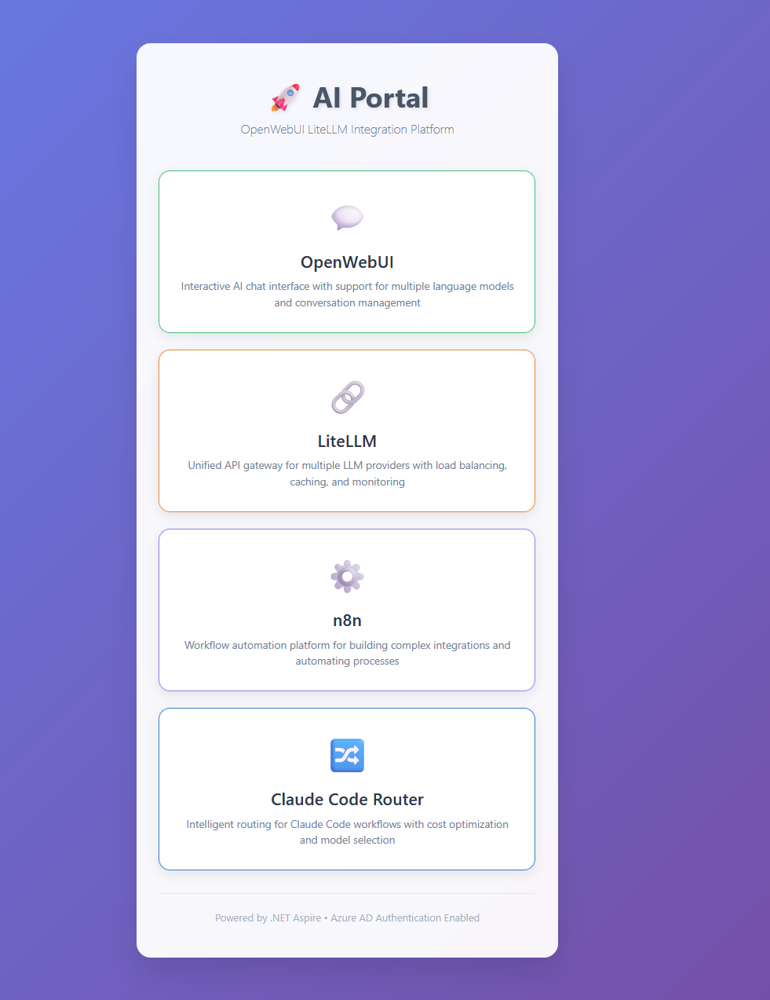
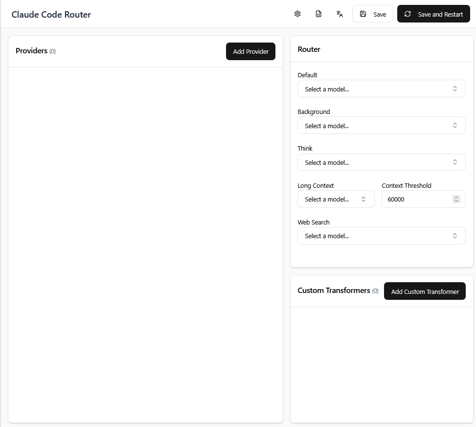
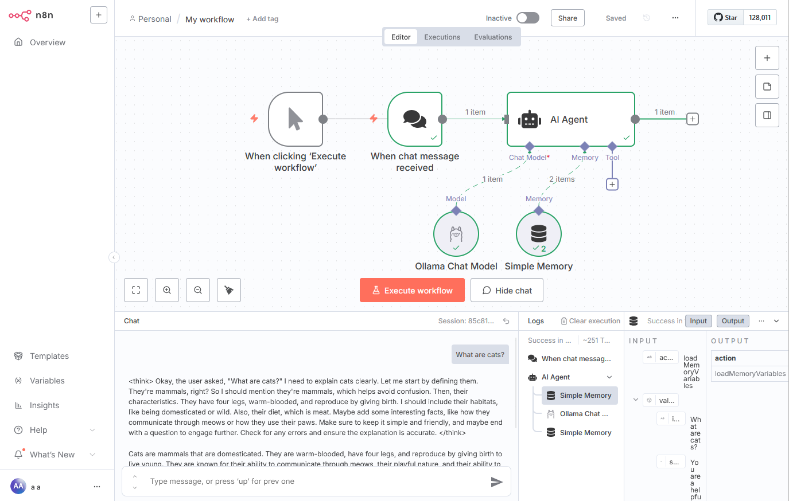

# 🐺 WolfPackAI

> **⚠️ Alpha Release Notice**: WolfPackAI is currently in alpha development. While the core architecture is solid, some features may not be fully functional yet. We're actively working to complete all integrations and resolve any remaining issues over the coming days.

**WolfPackAI** is a comprehensive AI development and deployment platform that orchestrates multiple AI services into a unified, production-ready environment. Built on .NET Aspire, it provides enterprise-grade AI infrastructure with advanced routing, workflow automation, and developer tools.

## ✨ Features

### 🎯 **Unified AI Portal**


A centralized dashboard providing seamless access to all AI services:
- **OpenWebUI** - Interactive chat interface with multi-model support
- **LiteLLM** - Unified API gateway for multiple LLM providers
- **Claude Code Router** - Intelligent routing for Claude Code workflows
- **n8n** - Visual workflow automation platform

### 🚀 **Enterprise Architecture**

- **Containerized Microservices**: Docker-based architecture with proper service isolation
- **Azure AD Authentication**: Enterprise SSO with OAuth/OIDC integration
- **Advanced Reverse Proxy**: YARP-based intelligent request routing
- **PostgreSQL Database**: Multi-tenant data persistence across all services
- **Local LLM Support**: Ollama integration with GPU acceleration
- **Development Environment**: Full SSH-accessible development container

### 🔧 **Developer Experience**

- **Claude Code Router Integration**: Specialized routing for development workflows
- **Multi-Language Development**: Pre-configured .NET, Node.js, Python, and C++ environments  
- **Real-time Monitoring**: OpenTelemetry observability with Aspire Dashboard
- **Hot Configuration**: Dynamic service configuration without restarts

## 🏗️ Architecture Overview

WolfPackAI orchestrates the following services in a cohesive microservices architecture:

| Service | Purpose | Port | Technology |
|---------|---------|------|------------|
| **Reverse Proxy** | Traffic routing & landing page | 80/443 | YARP (.NET) |
| **OpenWebUI** | AI chat interface | 8080 | Python/Docker |
| **LiteLLM** | LLM API gateway | 4000 | Python/Docker |
| **Claude Code Router** | Development-focused AI routing | 3456 | Node.js |
| **n8n** | Workflow automation | 5678 | Node.js/Docker |
| **Ollama** | Local LLM runtime | 1143 | Go/Docker |
| **PostgreSQL** | Primary database | 5432 | PostgreSQL |
| **Dev Container** | Development environment | 2222 (SSH) | Ubuntu 24.04 |

## 🛠️ Advanced Integrations

### Claude Code Router Configuration


The integrated Claude Code Router provides:
- **Intelligent Model Selection**: Automatic routing based on request complexity
- **Cost Optimization**: Smart model selection to minimize API costs  
- **Custom Transformers**: Request/response transformation capabilities
- **Fallback Strategies**: Seamless failover between AI providers

### n8n Workflow Automation  


Visual workflow automation including:
- **AI Agent Workflows**: Automated AI-driven processes
- **Service Integration**: Connect all platform services via workflows
- **Webhook Support**: External system integration capabilities
- **Memory Management**: Persistent workflow state and variables

## 🚀 Quick Start

### Prerequisites

- [.NET 9 SDK](https://dotnet.microsoft.com/download) 
- [Docker Desktop](https://www.docker.com/products/docker-desktop)
- Azure AD tenant (for authentication)
- API keys for your preferred LLM providers

### Installation

1. **Clone the repository:**
   ```bash
   git clone https://github.com/your-org/WolfPackAI.git
   cd WolfPackAI
   ```

2. **Configure the application:**
   
   Edit `WolfPackAI.AppHost/appsettings.json` with your settings:
   ```json
   {
     "Auth": {
       "AzureAd": {
         "TenantId": "your-tenant-id",
         "ClientId": "your-client-id", 
         "ClientSecret": "your-client-secret"
       }
     },
     "LiteLLM": {
       "ModelList": [
         {
           "ModelName": "gpt-4",
           "LiteLLMParams": {
             "Model": "azure/gpt-4",
             "ApiBase": "https://your-resource.openai.azure.com/",
             "ApiKey": "env:AZURE_API_KEY"
           }
         }
       ],
       "GeneralSettings": {
         "MasterKey": "your-secure-master-key"
       }
     }
   }
   ```

3. **Set up environment variables:**
   ```bash
   export AZURE_API_KEY="your-api-key"
   # Add other API keys as needed
   ```

4. **Launch the platform:**
   ```bash
   dotnet run --project WolfPackAI.AppHost
   ```

5. **Access services:**
   - **AI Portal**: http://localhost:5000/
   - **Chat Interface**: http://localhost:5000/chat  
   - **LiteLLM Admin**: http://localhost:5000/litellm/
   - **n8n Workflows**: http://localhost:5000/n8n/
   - **CCR Interface**: http://localhost:5000/ccr/ui
   - **SSH Development**: `ssh developer@localhost -p 2222` (password: `devpassword`)

## 🔐 Authentication & Security

### Azure Active Directory Integration

WolfPackAI uses Azure AD for centralized authentication:

- **Single Sign-On**: Unified login across all services
- **Account Consolidation**: Email-based account merging
- **OAuth/OIDC**: Modern authentication standards
- **Role-Based Access**: Fine-grained permissions (planned)

### Security Best Practices

- **API Key Management**: Environment variable-based secret handling
- **CORS Configuration**: Configurable cross-origin policies  
- **TLS/HTTPS**: Full encryption support for production
- **Container Isolation**: Proper network segmentation

## 🔧 Development

### Development Environment Access

The platform includes a full development container accessible via SSH:

```bash
# SSH into development environment  
ssh developer@localhost -p 2222

# Password: devpassword
# Or use key-based authentication
```

**Pre-installed tools:**
- .NET 9.0 SDK
- Node.js 22.x
- Python 3.x  
- C++ build tools
- Git, Vim, Nano
- Claude Code Router

### Building and Testing

```bash
# Build the entire solution
dotnet build

# Run all tests  
dotnet test

# Clean build artifacts
dotnet clean
```

### Service Monitoring

Access the Aspire Dashboard to monitor:
- Service health and status
- Real-time logs from all containers
- OpenTelemetry metrics and traces
- Resource utilization

## 🎯 Use Cases

### AI Development Teams
- **Multi-Model Experimentation**: Compare different AI providers
- **Cost Optimization**: Intelligent routing reduces API costs  
- **Workflow Automation**: Automate repetitive AI tasks with n8n
- **Development Integration**: SSH development environment with AI tools

### Enterprise Deployment  
- **Centralized AI Gateway**: Single point of access for all AI services
- **Authentication Integration**: Azure AD enterprise SSO
- **Monitoring & Observability**: Full OpenTelemetry implementation
- **Scalable Architecture**: Container-ready for Kubernetes deployment

### Research & Prototyping
- **Local LLM Support**: Ollama integration for offline development
- **Visual Workflows**: n8n for complex AI process automation  
- **Multi-Language Support**: Comprehensive development environment
- **Real-time Experimentation**: Hot configuration updates

## 🗺️ Roadmap

### Phase 1 (Current Alpha)
- ✅ Core service orchestration
- ✅ Basic authentication integration
- ✅ Service routing and proxy
- ⏳ Complete n8n workflow integration
- ⏳ Claude Code Router optimization

### Phase 2 (Beta Release)
- 🔄 Role-based access control
- 🔄 Enhanced monitoring dashboard  
- 🔄 Kubernetes deployment manifests
- 🔄 Advanced workflow templates

### Phase 3 (Production)
- 📋 Multi-tenant architecture
- 📋 Advanced security hardening
- 📋 Auto-scaling capabilities  
- 📋 Cloud provider integrations

## 🤝 Contributing

WolfPackAI is actively under development. While we're not yet accepting external contributions, we welcome:

- **Bug reports** via GitHub Issues
- **Feature requests** and suggestions
- **Documentation improvements**
- **Community feedback**

## 📜 License

This project is licensed under the MIT License - see the [LICENSE.txt](LICENSE.txt) file for details.

## 🆘 Support

- **Documentation**: See [CLAUDE.md](CLAUDE.md) for detailed technical documentation
- **Issues**: Report bugs and request features via GitHub Issues
- **Discussions**: Join our community discussions (coming soon)

---

**Built with ❤️ using .NET Aspire, Docker, and modern AI technologies.**

*WolfPackAI - Unleashing the power of AI through intelligent orchestration.*