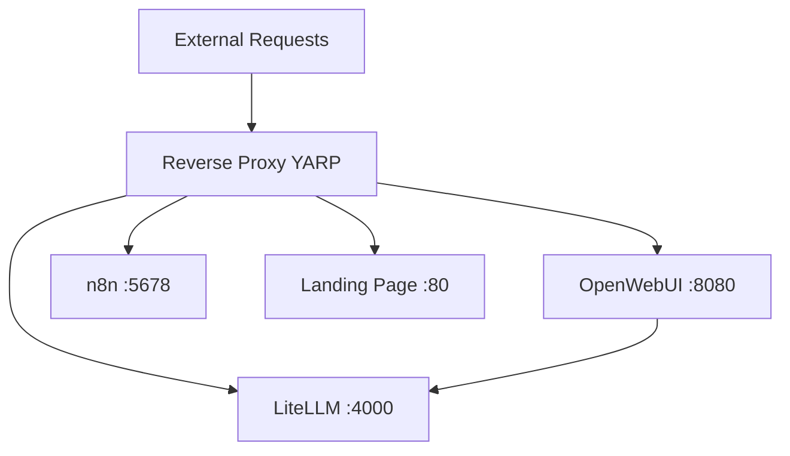
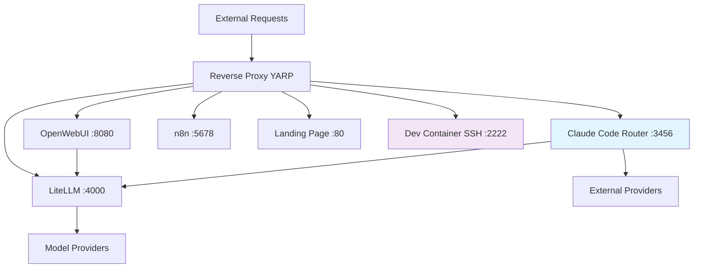

# Claude Code Router + LiteLLM Integration Architecture

## Overview
This document outlines the integration architecture for combining Claude Code Router (CCR) with LiteLLM to create a hybrid AI routing system that leverages the strengths of both platforms.

## Architecture Design

### Current State


### Target Architecture


## Routing Strategy

### Service Responsibilities

| Service | Primary Use Cases | Port | Strengths |
|---------|------------------|------|-----------|
| **LiteLLM** | General AI routing, Chat UI, Embeddings, Vision, Speech | 4000 | Broad model ecosystem, OpenAI compatibility |
| **Claude Code Router** | Developer workflows, Code generation, Claude Code CLI | 3456 | Specialized routing, Cost optimization, /model overrides |
| **OpenWebUI** | User chat interface, Conversations | 8080 | User-friendly UI, Chat management |
| **Dev Container** | Development environment | 2222 | Multi-language dev tools, SSH access |

### Request Routing Logic

#### 1. Path-Based Routing
```
/chat/*          → OpenWebUI → LiteLLM
/litellm/*       → LiteLLM (direct)
/claude-code/*   → Claude Code Router
/ccr/*           → Claude Code Router (alternative path)
/n8n/*           → n8n Workflows
/                → Landing Page
```

#### 2. User-Agent Based Routing  
```
Claude-Code CLI  → Claude Code Router
Web Browsers     → OpenWebUI/Landing Page
API Clients      → LiteLLM (direct)
```

#### 3. Content-Type Based Routing
```
application/json (with Claude Code markers) → Claude Code Router
multipart/form-data (file uploads)         → OpenWebUI
application/json (general AI)              → LiteLLM
```

## Integration Points

### 1. CCR → LiteLLM Fallback
Configure CCR to use LiteLLM as a fallback provider:
```json
{
  "providers": [
    {
      "name": "litellm-internal",
      "api_base_url": "http://litellm:4000/v1",
      "api_key": "${LITELLM_MASTER_KEY}",
      "models": ["claude-3-sonnet", "gpt-4", "gemini-pro"],
      "transformers": ["Anthropic", "OpenAI"]
    }
  ]
}
```

### 2. LiteLLM → CCR Routing
Configure LiteLLM to route Claude Code requests to CCR:
```yaml
litellm_settings:
  custom_router:
    - pattern: "claude-code-*"
      target: "http://devcontainer:3456/v1/messages"
    - pattern: "ccr-*" 
      target: "http://devcontainer:3456/v1/messages"
```

### 3. Reverse Proxy Configuration
Extend YARP configuration to include CCR routing:
```json
{
  "claude-code-route": {
    "ClusterId": "ccr-cluster",
    "Order": 1,
    "Match": {
      "Path": "/claude-code/{**catch-all}"
    },
    "Transforms": [
      { "PathRemovePrefix": "/claude-code" },
      { "RequestHeader": "X-Forwarded-For", "Append": "{RemoteIpAddress}" }
    ]
  },
  "ccr-ui-route": {
    "ClusterId": "ccr-cluster", 
    "Order": 2,
    "Match": {
      "Path": "/ccr/{**catch-all}"
    },
    "Transforms": [
      { "PathRemovePrefix": "/ccr" }
    ]
  }
}
```

## Development Container Integration

### Container Modifications
Update the development container to include CCR:

```bash
# Install Node.js (already done)
# Install Claude Code CLI
npm install -g @anthropic-ai/claude-code

# Install Claude Code Router
npm install -g @musistudio/claude-code-router

# Setup CCR configuration
mkdir -p ~/.claude-code-router
```

### Service Management
Create systemd-style service management in the container:

```bash
# CCR service management
ccr start   # Start CCR service on port 3456
ccr stop    # Stop CCR service  
ccr restart # Restart CCR service
ccr status  # Check service status
ccr ui      # Open web UI (accessible via reverse proxy)
```

## Configuration Templates

### CCR Configuration Template
```json
{
  "APIKEY": "${CCR_API_KEY:-ccr-dev-key}",
  "API_TIMEOUT_MS": 600000,
  "HOST": "0.0.0.0", 
  "PORT": 3456,
  "providers": [
    {
      "name": "litellm-fallback",
      "api_base_url": "http://litellm:4000/v1",
      "api_key": "${LITELLM_MASTER_KEY}",
      "models": ["claude-3-sonnet", "gpt-4", "gemini-pro"],
      "transformers": ["Anthropic", "OpenAI"]
    },
    {
      "name": "deepseek",
      "api_base_url": "https://api.deepseek.com/v1", 
      "api_key": "${DEEPSEEK_API_KEY}",
      "models": ["deepseek-chat", "deepseek-coder"],
      "transformers": ["deepseek"]
    },
    {
      "name": "ollama-local",
      "api_base_url": "http://ollama:11434/v1",
      "models": ["qwen2.5-coder:latest", "codellama:7b"],
      "transformers": ["OpenAI"]
    }
  ],
  "router": {
    "default": "deepseek,deepseek-chat",
    "background": "ollama-local,qwen2.5-coder:latest",
    "think": "litellm-fallback,claude-3-sonnet", 
    "longContext": "litellm-fallback,gemini-pro",
    "webSearch": "litellm-fallback,gpt-4",
    "coder": "deepseek,deepseek-coder"
  },
  "transformers": {
    "enableToolForcing": true,
    "maxTokens": 4096,
    "temperature": 0.1
  }
}
```

### LiteLLM Configuration Updates
Add CCR integration to existing LiteLLM config:
```yaml
# Add to existing litellm-config.yaml
model_list:
  # Existing models...
  - model_name: ccr-claude-sonnet
    litellm_params:
      model: claude-3-sonnet-20241022
      api_base: http://devcontainer:3456/v1
      api_key: ${CCR_API_KEY}
      
routing_settings:
  fallback_models:
    - ccr-claude-sonnet
    - claude-3-sonnet
```

## Benefits of This Architecture

### 1. Specialized Routing
- **LiteLLM**: Handles general AI requests, chat UI, embeddings, vision
- **CCR**: Optimized for developer workflows, code generation, Claude Code CLI

### 2. Cost Optimization  
- Route expensive Claude operations to cheaper alternatives (DeepSeek, Ollama)
- Use appropriate models for different task types (coding vs reasoning vs chat)

### 3. Flexibility
- Choose per-project whether to use CCR directly or through LiteLLM
- Support for `/model provider,model_name` overrides in Claude Code
- Fallback mechanisms between systems

### 4. Developer Experience
- Maintain existing OpenWebUI chat interface
- Add CCR's specialized developer tools and workflows
- Access both systems through unified reverse proxy

### 5. Reliability
- Multiple fallback paths for critical requests
- Health checks and service monitoring
- Graceful degradation when services are unavailable

## Next Steps

1. **Install CCR in development container**
2. **Configure CCR with LiteLLM integration**
3. **Update reverse proxy routes**
4. **Create configuration management tools**
5. **Add monitoring and health checks**
6. **Document usage patterns and best practices**

This hybrid architecture provides the best of both worlds: LiteLLM's broad AI capabilities with CCR's specialized Claude Code developer workflow optimization.